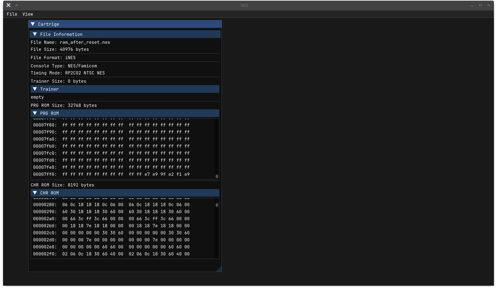

# NEZ
NES emulator written in Zig.

## ToDo
- [x] load NES file
    - [ ] implement mappers
- [ ] implement input devices
- [ ] emulate CPU
- [ ] emulate PPU
- [ ] emulate APU

## Dependencies
- [Zig 0.13.0](https://ziglang.org/download/)

### Included Dependencies
- [zig-gamedev](https://github.com/zig-gamedev/zig-gamedev)
- [JetBrainsMono](https://www.jetbrains.com/lp/mono/)
- [NerdFont](https://www.nerdfonts.com/)
- [nes-test-roms](https://github.com/christopherpow/nes-test-roms)
- [zosdialog](https://github.com/l3x61/zosdialog)

## References
- [NES Architecture](https://www.copetti.org/writings/consoles/nes/)
- [Nesdev Wiki](https://www.nesdev.org/wiki/Nesdev_Wiki)

## Issues
- osdialog does not work on Wayland, most likely because `libdecor-gtk`